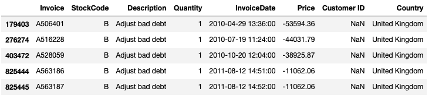

You probably heard before that when a data scientist works on a project, most of the effort usually goes to cleaning and exploring the dataset (we'll get to explore the dataset in another post but in this post, we will focus on cleaning datasets). When I first started learning data science, I took this statement to be true but I didn't think too much about it. Eventually, when I started doing analytics and machine learning modeling, I came to realize how important it is not to start exploring your data or try to gain insight from the numbers until I'm 100% sure the dataset I'm working with is clean. 

So why is cleaning your dataset important? Cleaning your dataset ensures that whatever insight you get from the dataset is a real insight. If your dataset is not clean, then it doesn't reflect the real events it was supposed to represent. Now imagine sharing that insight with a client who is supposed to make decisions according to that insight. Most likely, that decision isn't going to be a good decision, and if it turns out to be, it was just luck! it wasn't because of your insight. Of course, some datasets aren't the same in terms of how much cleaning they need. So you wouldn't always necessarily spend most of your effort in cleaning the dataset. But again, your analytics lead to decisions, and for these decisions to be right and wise, your dataset must be clean. 
Another reason why your dataset needs to be clean is if you are planning to fit your data to machine learning models. Your model will be trained with the dataset you have. So if you're dataset doesn't reflect reality, neither will your model. 

In this post, we'll go through the cleaning process together and I hope I can show why cleaning is a significant step in your project. 


# The Dataset
The dataset contains transactions of an online store that sell gift-ware between 01/12/2009 and 09/12/2011. Customers are wholesalers. The online store is UK-based.

[The dataset](https://archive.ics.uci.edu/ml/datasets/Online+Retail+II) we're gonna work with today contains transactions of an online store that sell gift-ware to wholesalers. The online store is UK-based and the transactions are from 1/12/2009 to 09/12/2011. So we're gonna have a lot of records.

we'll start with obvious which is import the needed libraries. 

```
import pandas as pd
import numpy as np
import matplotlib.pyplot as plt
import matplotlib as mpl
%matplotlib inline
```

Usually, the next step is to read the dataframe and print the first ten rows to get a sense of it. But in this case, our dataset is in excel format with two sheets. So we will have to read each sheet as a separate dataframe then combine them in one dataframe. Let's do that. 


```
df = pd.read_excel('online_retail_II.xlsx', sheet_name=0)
print(df.shape)
df1 = pd.read_excel('online_retail_II.xlsx', sheet_name=1)
print(df1.shape)
df = pd.concat([df, df1], ignore_index=True) #ignore index skips the index as part of the concatination. 
print(df.shape)
```

Notice that I'm printing the shape of each dataframe so that we make sure the concatenation worked.  The output of each line says:
- The first sheet had 525461 records and 8 columns. 
- The second sheet has 541910 records and 8 columns. 
- The concatenated dataframe had 1067371 records and 8 columns which tell us our concatenation is successful.

Now, let's print the rows in the dataset to get a sense of it.


As we can see, the columns are easy to interpret. each row explains a transaction or a part of it. We have an invoice code of each transaction, the stock code of the product, a description of the product, the quantity ordered, the date and time of the transaction, the price of the product, the customer ID, and the country of the customer. 
The next step is to check the data types of our columns and how many records each has. Sometimes, Pandas defines columns with an incorrect data type like defining a date type column as a string.

```
df.info()
```

the output: 


The date column is defined as a datetime type as it should be. From the earlier screenshot, The data in the invoice column shows integer values which makes the fact that it's defined as object a bit strange. Although, reading the description of the dataset [here](https://archive.ics.uci.edu/ml/datasets/Online+Retail+II) tells us that the canceled orders contain the letter 'C' in the invoice code. So, even though it didn't appear in the screenshot, some values in the invoice column contain a letter so defining it as an object is correct. It's very important to read the description or the documentation of the dataset. The more you know the less crazy you get while working with your data. 

Another thing the output above shows is the missing values. The description column has 4382 missing values but as both the description and stock code represent the same product, not having a product description in a certain record isn't a problem. Customer ID also has missing values and that might be because the orders were made by guests (non-registered users). we'll continue investigating our dataset and see whether we need to drop any of these missing values. For now, we'll just keep it. 

Now let's check some stats for the numerical columns. 
```
df.describe
```

The output:


Most of the numbers don't seem to raise our eyebrows. except for two values. If you notice, The minimum of the quantity is a negative value. Same with the price column. What does a negative quantity even mean? The price column not only has negative values but in some records the price zero which doesn't make sense. I don't know about you but this just got interesting. Let's check records where the price is zero first. 

```
df[df['Price'] == 0]
```

This is part of the output:


Do you notice something strange? you should! If you check the whole output you'll notice that the description of the products includes words like smashed, damaged, discoloured, thrown away, or lost. So, these are not sales. Probably the person who did the data entry only wanted to document where the products went. Either way, these records can be safely dropped as we're only focusing on sales. 
One way we can drop these records is to mask the ones with 0 values in the price column then create a dataframe that includes all the unmasked records.


```
zero_price_mask = df['Price'] == 0
df_nozeros = df.loc[~zero_price_mask,:]
```

To make sure things went as intended
```

print(len(df))
print(len(df_nozeros))
print(len(df[df['Price'] == 0]))
```

The original dataframe has 1067371 records, the new dataframe without the zeros is 1061169. subtracting the two numbers gives us 6202 which is the number of records where price equals zero. Good. 

Now, let's go back to what got us to this point which is having minimum quantities. Let's check the dataframe where we have quantities less than 0. 

```
df[df['Quantity'] < 0]
```


Checking the whole output, we can see that we have about 23000 records. that's a lot. Taking a closer look, we can see that all the invoice codes have the letter 'C' in them. From the documentation of the dataset, we know that this indicates canceled orders. Again, our goal is to focus on sales so we need to drop these orders. 

```
df_nozeros_nocancel = df_nozeros[~df_nozeros['Quantity'] < 0]
```

Now, I want to talk about something important and it's actually the reason why I decided to make this post. What if the system that our client uses shows both the initial orders and the canceled ones. For example, when a customer makes an order, then he/she cancels it two hours later the system shows both these orders. If that's the case, would just deleting the canceled orders be the right decision? Of course not. Deleting the canceled orders while leaving the initial orders means including orders that didn't happen in our analysis! (remember when we talked about how our dataset needs to reflect real events?) I'm not going to bother you with code but I spent about three hours until I concluded that deleting the canceled orders is safe and there are no initial orders I need to drop. This point should show you the importance of making sure you're working with a good representative dataset. Your analysis is as good as your dataset and you will not be doing your client any good if you work on your analysis right away without making sure the dataset is clean.  

Ok, now let's see the minimum of quantity column now 

```
df_nozeros_nocancel.describe()
```


It worked!, the minimum quantity is now 1. Although, the price column still has negative values so let's investigate that.

```
df_nozeros_nocancel[df_nozeros_nocancel['Price'] < 0]
```

The output: 



Confused? well, me too. But That doesn't seem to be sales to me. So, it's safe to drop the records. But I have to say, if the dataset was given to us by a client, we would need to ask about them. Sometimes, It's up to the client what needs to be factored in the analysis. In this case, we make the move. 

```
df_new = df_nozeros_nocancel[df_nozeros_nocancel['Price'] > 0]
```

I don't know about you but our dataset looks clean to me and we're ready to do our analysis! Well, with this time and effort spent on cleaning I'm not sure if we're *ready*, and not tired, but you get my point.
I hope this post showed why a data analyst or a data scientist talks a lot about cleaning datasets. When I was cleaning this dataset and I had to spend three hours making sure there are no initial records for the canceled orders, I was frustrated and satisfied at the same time. Frustrated because I spent a lot of time just trying to find initial orders and I found none! Satisfied because then I knew for sure that I don't have initial orders and I can drop the canceled orders with a clean conscience (I'm taking it too far I know.) Anyway, I hope you don't stop here and get your hands dirty as this is the most effective way to be a good data scientist.


